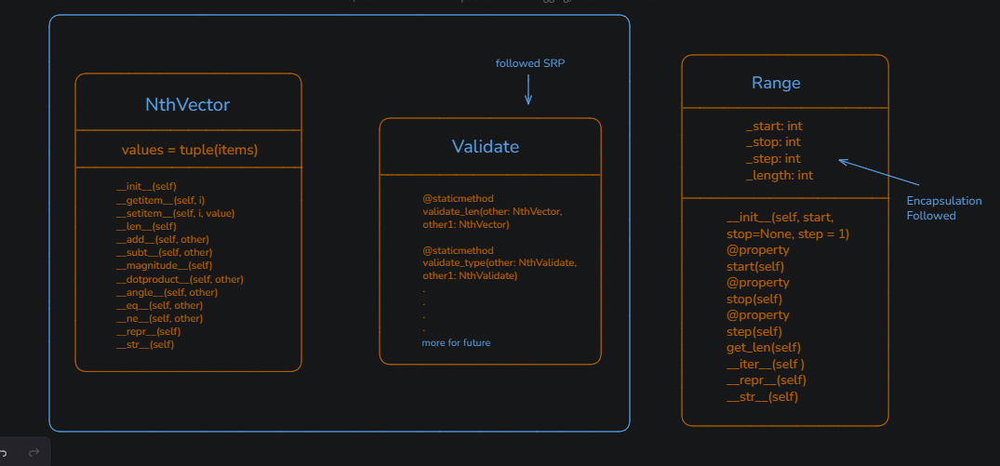

# NVector and Range Classes in Python

This project implements two custom Python classes:

1. **NVector** → A class to represent n-dimensional mathematical vectors.
2. **Range** → A class that mimics Python's built-in `range`.

---

## 🚀 Features

### NVector
- Create vectors of any dimension.
- Add and subtract vectors.
- Scalar multiplication.
- Dot product.
- Magnitude (length of vector).

### Range
- Works like Python's built-in `range`.
- Supports start, stop, step.
- Iterable with `for` loops.

---

## UML

